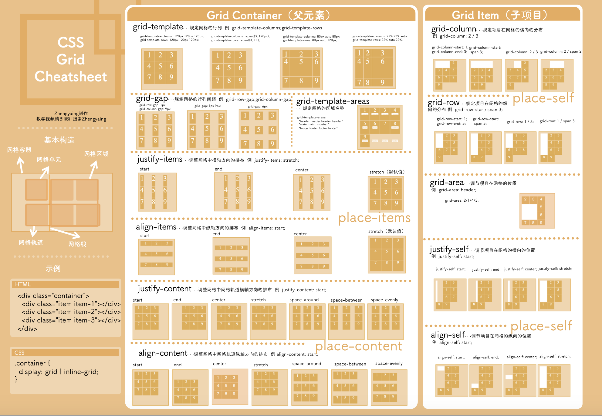
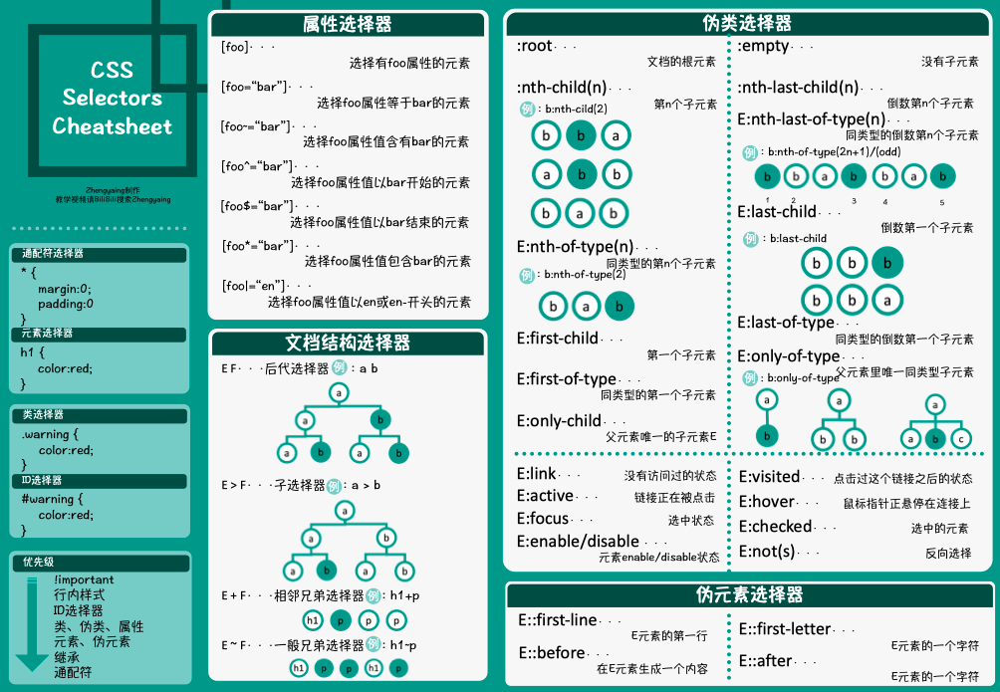
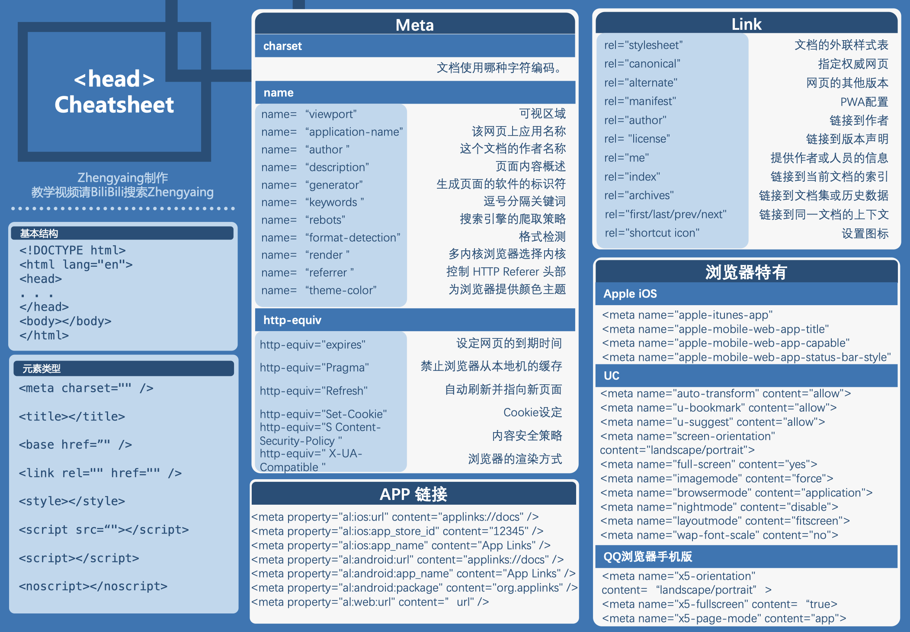
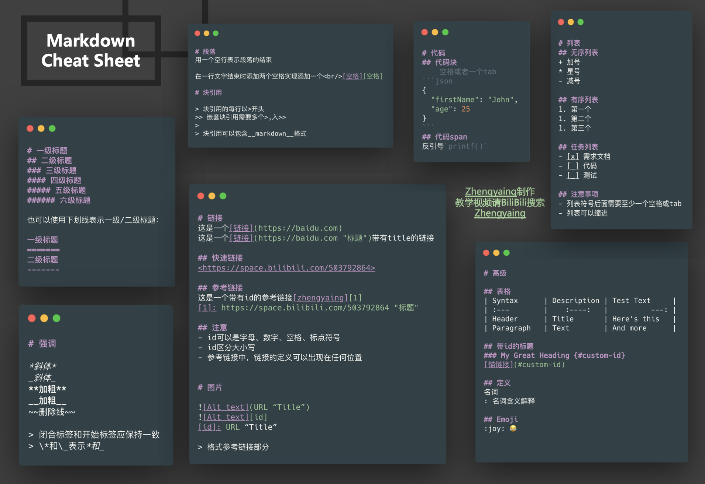
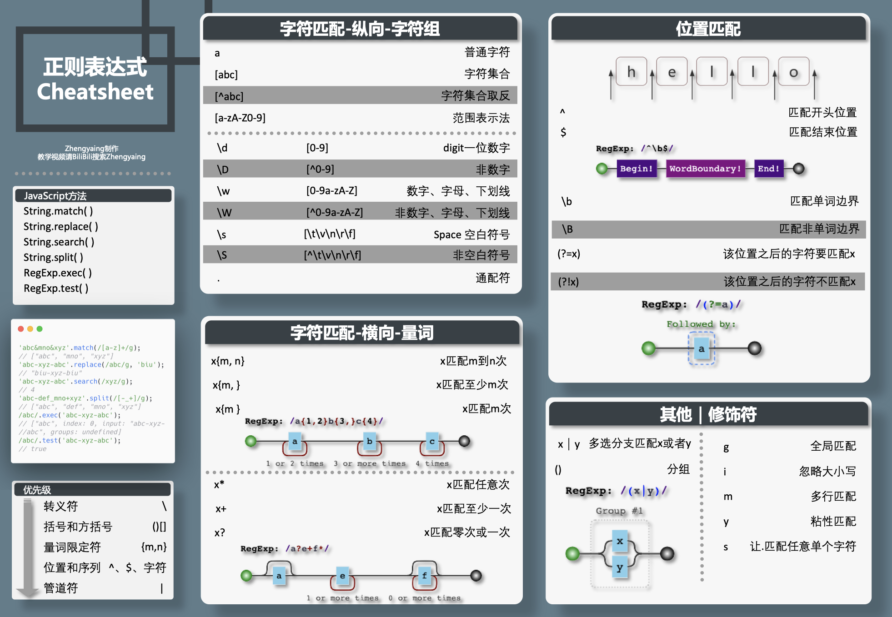
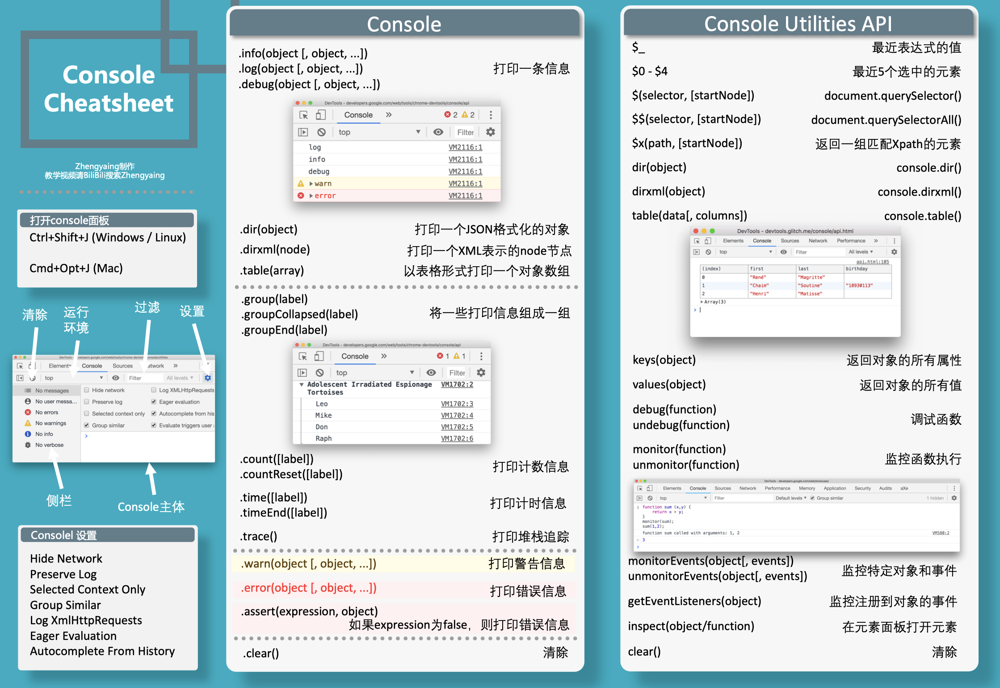
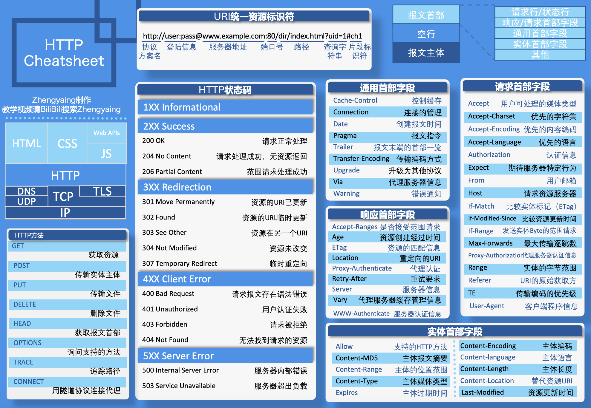

# 前端Cheat Sheet分享，一张图掌握一个知识点

欢迎大家在Issues里给我提想学的知识点，也可以给我提一些改进的建议

因为国内github网络问题，最近新增了Gitee的网址：[Gitee](https://gitee.com/zhengyaing/cheatsheet)

## 这个项目本身来源于我的视频分享：[B站讲解视频](https://space.bilibili.com/503792864)

### 截图预览

### 国内百度云盘下载地址

链接: https://pan.baidu.com/s/1dT1Q0dft7nEY5wPkaM2CCw 提取码: 44mf

### BiliBili教学视频

[一张图彻底掌握Grid网格布局](https://www.bilibili.com/video/BV1jA411h7sy/)

[一张图掌握Flexbox弹性盒子布局](https://www.bilibili.com/video/BV1K64y1u7eb/)

[一张图掌握BoxModel](https://www.bilibili.com/video/BV1ni4y1t7jK/)

[一张图掌握Git](https://www.bilibili.com/video/BV1AZ4y1x7Do/)

[一张图掌握CSS Selector](https://www.bilibili.com/video/BV1kk4y1R78f)

[一张图掌握Head标签](https://www.bilibili.com/video/BV1ui4y1b7UW/)

[一张图掌握Markdown](https://www.bilibili.com/video/BV1sz411z7qd/)

[一张图掌握正则表达式](https://www.bilibili.com/video/BV1jT4y137qt/)

[一张图掌握console](https://www.bilibili.com/video/BV1oz4y1R7yu/)

[一张图掌握HTTP基础](https://www.bilibili.com/video/BV1Ua4y1e7rC/)

### 打赏

如果您觉得此项目对您有帮助，请我喝一杯咖啡☕️吧！

